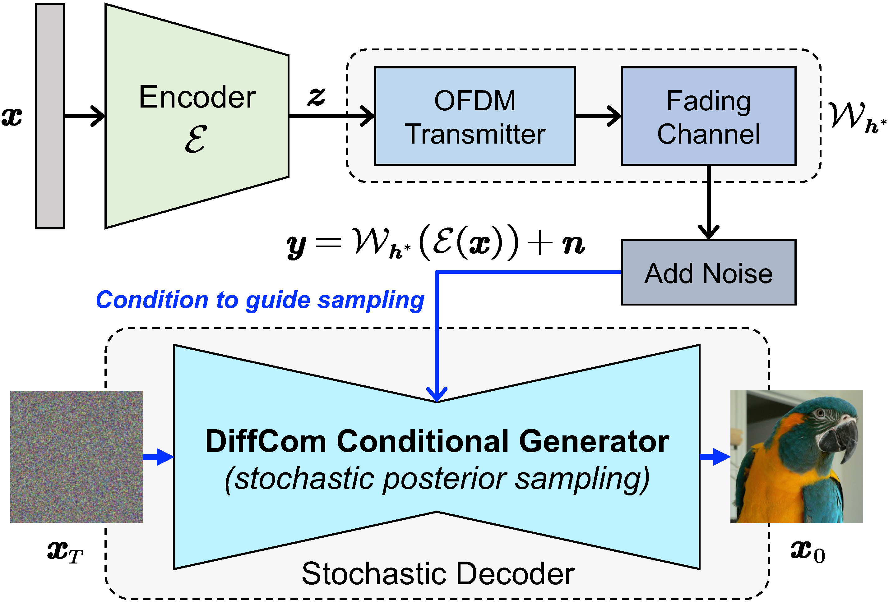
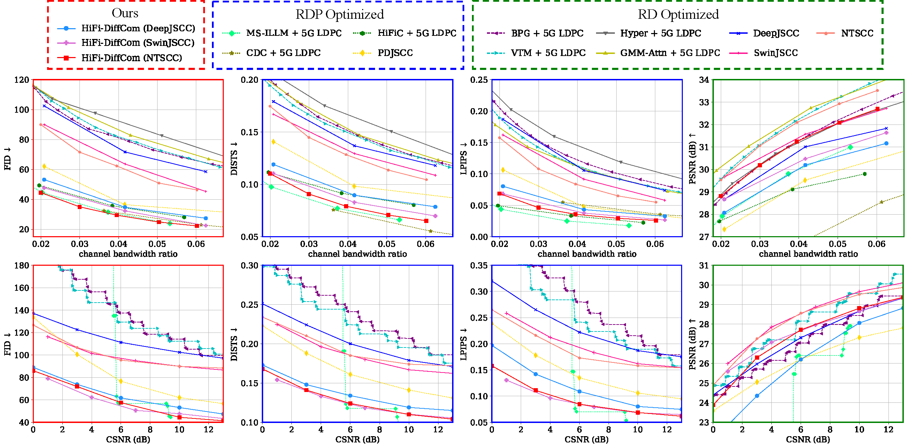
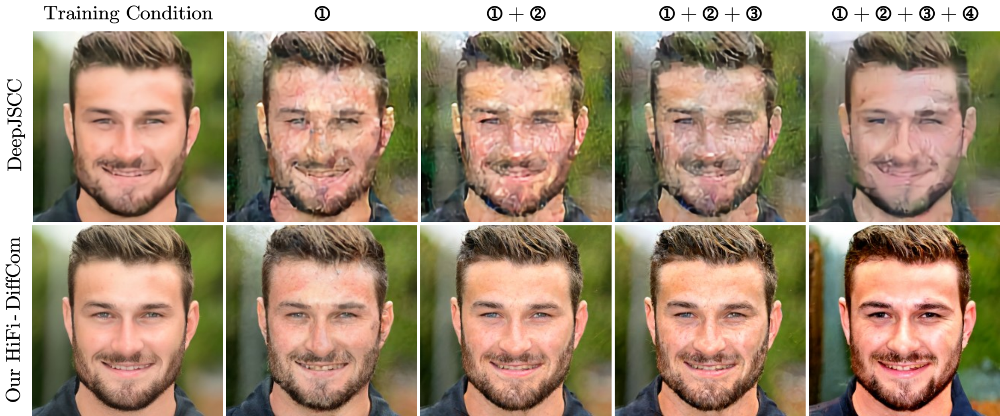
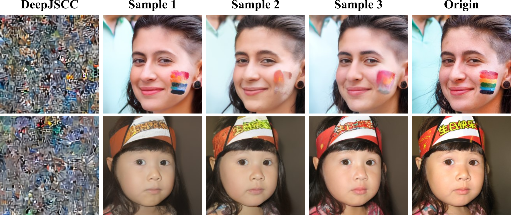

# DiffCom: Channel Received Signal is a Natural Condition to Guide Diffusion Posterior Sampling [[pdf]](https://arxiv.org/abs/2406.07390)

Here is the implementation of the
paper "[DiffCom: Channel Received Signal is a Natural Condition to Guide Diffusion Posterior Sampling](https://semcomm.github.io/DiffCom/)".

Project website: [https://semcomm.github.io/DiffCom/](https://semcomm.github.io/DiffCom/)

## Abstract

End-to-end visual communication systems typically optimize a trade-off between channel bandwidth costs and signal-level
distortion metrics. However, under challenging physical conditions, this traditional coding and transmission paradigm
often results in unrealistic reconstructions with perceptible blurring and aliasing artifacts, despite the inclusion of
perceptual or adversarial losses for optimizing. This issue primarily stems from the receiver’s limited knowledge about
the underlying data manifold and the use of deterministic decoding mechanisms. 
To address these limitations, this paper
introduces DiffCom, a novel end-to-end generative communication paradigm that utilizes off-the-shelf generative priors
and probabilistic diffusion models for decoding, thereby improving perceptual quality without heavily relying on
bandwidth costs and received signal quality. Unlike traditional systems that rely on deterministic decoders optimized
solely for distortion metrics, our DiffCom leverages raw channel-received signal as a fine-grained condition to guide
stochastic posterior sampling. Our approach ensures that reconstructions remain on the manifold of real data with a
novel confirming constraint, enhancing the robustness and reliability of the generated outcomes.

## Overview of the DiffCom system architecture



## RDP curves on [FFHQ](https://github.com/NVlabs/ffhq-dataset) testset



## Generalization to unseen wireless conditions



## Blind-DiffCom Achieves Pilot-Free Transmission



## Requirements

Clone the repo and create a conda environment (we use PyTorch 1.9, CUDA 11.1).

TODO: check the dependencies

## Model Download

We provide 3 pre-trained ADJSCC models in [this link](https://drive.google.com/drive/folders/1N0EzzxCv1wh6JeFr0g8vkmB0Qj23ozZJ?usp=sharing), please download them and put them in the `_djscc/ckpt` folder.

The pre-trained Diffusion models are available at the following links, please download them and put them in the `model_zoo` folder.

| Model                                                       |                                               Download link                                                |
|-------------------------------------------------------------|:----------------------------------------------------------------------------------------------------------:|
| 256x256_diffusion_uncond.pt(ILSVRC 2012 subset of ImageNet) | [download link](https://openaipublic.blob.core.windows.net/diffusion/jul-2021/256x256_diffusion_uncond.pt) |
| ffhq_10m.pt                                                 |   [download link](https://drive.google.com/drive/folders/1jElnRoFv7b31fG0v6pTSQkelbSX3xGZh?usp=sharing)    |

TODO: provide implementations of DiffCom based on \`SwinJSCC\` and \`NTSCC+\`.

## Inference Code

```bash
python main_diffcom.py --opt ./configs/diffcom.yaml
```

Please check the `diffcom.yaml` file for more details. 
The codebase now supports `diffcom`, `hifi_diffcom`, and `blind_diffcom`.

You can change the hyperparameters in the YAML file to run the corresponding method.

## Acknowledgement

The implementation is based on [DPS](https://github.com/DPS2022/diffusion-posterior-sampling), [PSLD](https://github.com/LituRout/PSLD).  
We thank the authors for sharing their code.

## Citation

If you find this code useful for your research, please cite our paper

```
@article{wang2024diffcom,
  title={DiffCom: Channel Received Signal is a Natural Condition to Guide Diffusion Posterior Sampling},
  author={Wang, Sixian and Dai, Jincheng and Tan, Kailin and Qin, Xiaoqi and Niu, Kai and Zhang, Ping},
  journal={arXiv preprint arXiv:2406.07390},
  year={2024}
}
```